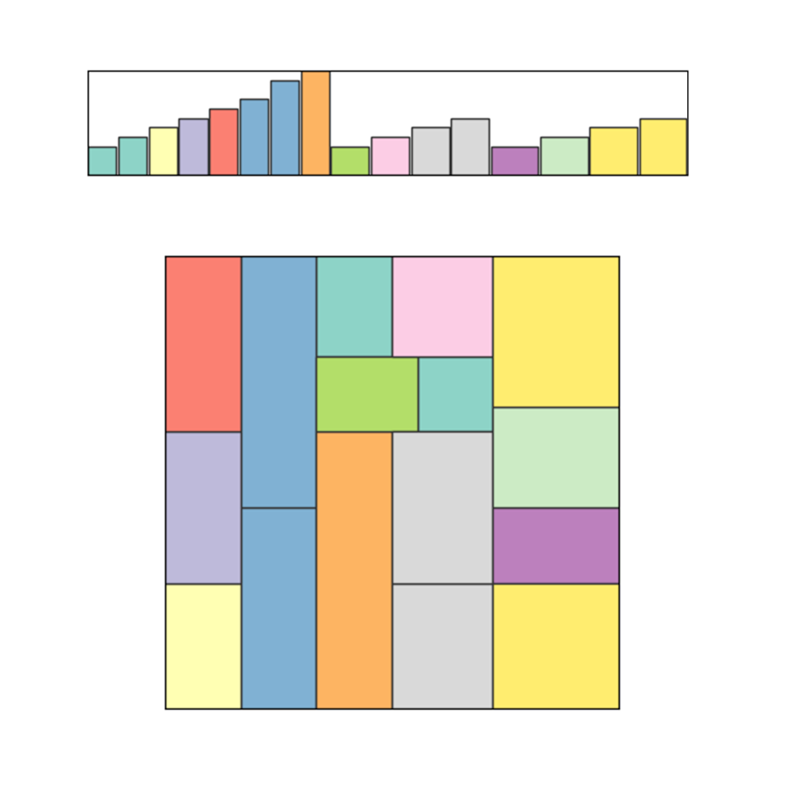

<div id="top"></div>

[![Contributors][contributors-shield]][contributors-url]
[![Stargazers][stars-shield]][stars-url]
[![MIT License][license-shield]][license-url]
[![Next][z3py]][z3py_url]


<!-- PROJECT LOGO -->
<br />
<div>
  <h1>VLSI Design</h1>

  <p>
    <h3> Project Work Combinatorial Decision Making and Optimization 2021/2022 </h2>
      Zeynep Kiziltan 
    <br />
      Roberto Amadini 
    <br />
  </p>
</div>


<!-- TABLE OF CONTENTS -->
<details>
  <summary>Table of Contents</summary>
  <ol>
    <li>
      <a href="#about-the-project">About The Project</a>
    </li>
    <li><a href="#usage">Usage</a></li>
    <li><a href="#contacts">Contacts</a></li>
  </ol>
</details>


<!-- ABOUT THE PROJECT -->
## About The Project

  <p align="center">
    
  </p>

This work consists in a Combinatorial Optimization approach to the Very Large Scale Integration (VLSI) problem. In particular, four different technologies are employed to address the problem
at hand, namely Constraint Programming (CP), propositional SATisfiability (SAT), Satisfiability Modulo Theories (SMT) and Linear Programming (LP).


<!-- USAGE EXAMPLES -->
### Usage

1. Use _requirements.txt_ to create a pip virtual environment:
   ```sh
   pip install -r requirements.txt
   ```
2. Run _runModel.py_ as follows. Strategy must be either CP, SAT, SMT or MIP.
   ```sh
    python runModel.py [-i instn] [-t timeout] [-v verbose] [-o outfile] [-r rotations] <strategy>
   ```

<!-- LICENSE -->
## License

Distributed under the MIT License. 


<!-- CONTACT -->
## Contact


* Antonio Morelli - [Linkedin](https://www.linkedin.com/in/antonio-morelli-077a16220/) - [GitHub](https://github.com/antoniototimorelli) - antonio.morelli3@studio.unibo.it

* Davide Baldelli - davide.baldelli4@studio.unibo.it

* Tommaso Cortecchia - tommaso.cortecchia@studio.unibo.it

* Stefano Ciapponi - stefano.ciapponi@studio.unibo.it

<p align="right">(<a href="#top">back to top</a>)</p>


<!-- MARKDOWN LINKS & IMAGES -->
<!-- https://www.markdownguide.org/basic-syntax/#reference-style-links -->
[contributors-shield]: https://img.shields.io/github/contributors/drchapman-17/cdmo2022?style=flat-square

[contributors-url]: https://github.com/drchapman-17/cdmo2022/graphs/contributors

[stars-shield]: https://img.shields.io/github/stars/drchapman-17/cdmo2022?style=flat-square

[stars-url]: https://github.com/drchapman-17/cdmo2022/stargazers

[license-shield]: https://img.shields.io/github/license/drchapman-17/cdmo2022?style=flat-square

[license-url]: https://github.com/drchapman-17/cdmo2022/LICENSE

[z3py]: https://img.shields.io/pypi/v/z3-solver?label=z3-solver&style=flat-square

[z3py_url]: https://pypi.org/project/z3-solver/

